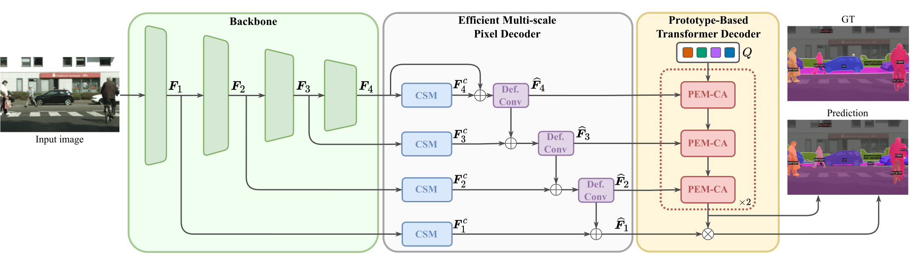
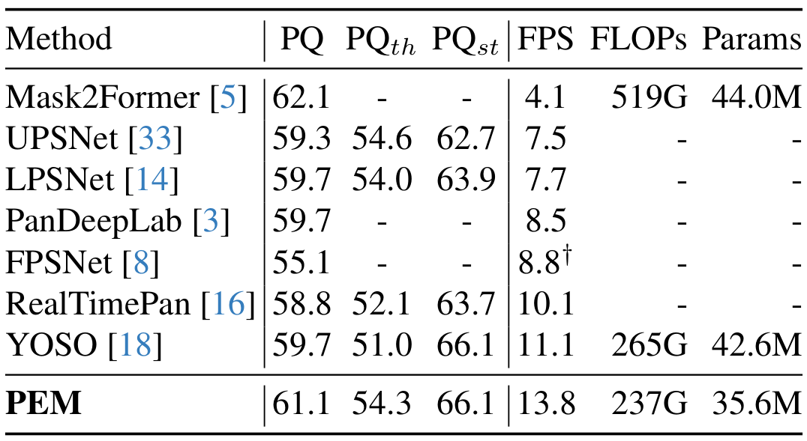
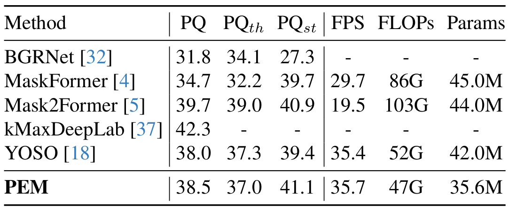
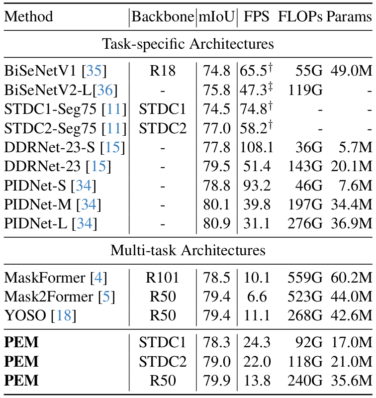
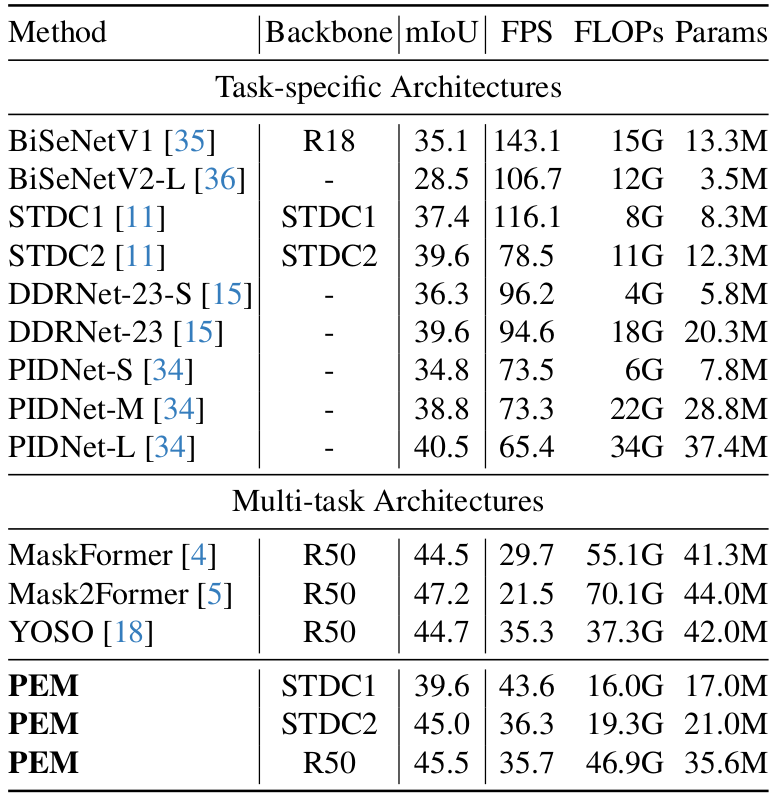

# PEM: Prototype-based Efficient MaskFormer for Image Segmentation [CVPR 2024]

> [Niccolò Cavagnero](https://scholar.google.com/citations?user=Pr4XHRAAAAAJ)\*, [Gabriele Rosi](https://scholar.google.com/citations?user=8AfX1GcAAAAJ)\*, [Claudia Cuttano](https://scholar.google.com/citations?user=W7lNKNsAAAAJ), [Francesca Pistilli](https://scholar.google.com/citations?user=7MJdvzYAAAAJ), [Marco Ciccone](https://scholar.google.com/citations?user=hOQjblcAAAAJ), [Giuseppe Averta](https://scholar.google.com/citations?user=i4rm0tYAAAAJ), [Fabio Cermelli](https://fcdl94.github.io/)
>
> _\* Equal Contribution_

\[[Project Page](http://niccolocavagnero.github.io/PEM)\]  \[[Paper](https://arxiv.org/abs/2402.19422)\]

This is the official PyTorch implementation of our work "PEM: Prototype-based Efficient MaskFormer for Image Segmentation" **accepted at CVPR 2024**.

<br>

**Prototype-based Efficient MaskFormer (PEM)** is an efficient transformer-based architecture that can operate in multiple segmentation tasks. PEM proposes a novel prototype-based cross-attention which leverages the redundancy of visual features to restrict the computation and improve the efficiency without harming the performance. 



## Table of Contents

- [Installation](#installation)
- [Data preparation](#data-preparation)
- [Training](#training)
- [Testing](#training)
- [Results](#results)
- [Citation](#citation)

## Installation

The code has been tested with `python>=3.8` and `pytorch==1.12.0`. To prepare the conda environment please run the following:

```bash
conda create --name pem python=3.10 -y
conda activate pem

conda install pytorch==1.12.0 torchvision==0.13.0 torchaudio==0.12.0 cudatoolkit=11.3 -c pytorch
python -m pip install 'git+https://github.com/facebookresearch/detectron2.git'

git clone https://github.com/NiccoloCavagnero/PEM.git
cd PEM
pip install -r requirements.txt
```

## Data preparation

For the dataset preparation, plese refer to the [Mask2Former guide](https://github.com/facebookresearch/Mask2Former/blob/main/datasets/README.md).

## Training

1. Before starting the training, you have to download the pretrained models for the backbone. The following commands will download the pretrained weights for STDC1 and STDC2 backbones (read more about [here](https://github.com/MichaelFan01/STDC-Seg)). For ResNet50, the pretrained weights are automatically downloaded from detectron2 repository.

    ```bash
    mkdir pretrained_models
    cd pretrained_models
    gdown 1DFoXcV42zy-apUcMh5P8WhsXMRJofgl8
    gdown 1Y5belNkq3Dn-EYgSKY-ICiPsN4TZXoXO
    python ../tools/convert-pretrained-stdc-model-to-d2.py STDCNet813M_73.91.tar STDC1.pkl
    python ../tools/convert-pretrained-stdc-model-to-d2.py STDCNet1446_76.47.tar STDC2.pkl
    cd ..
    ```
2. To train the model with `train_net.py`, run the following
    ```bash
    python train_net.py --num-gpus 4 \
      --config-file configs/cityscapes/semantic-segmentation/pem_R50_bs32_90k.yaml 
    ```

## Testing

To test the model, you can use `train_net.py` with the flag `--eval-only` along with the checkpoint path of the trained model.

```bash
python train_net.py --eval-only \
  --config-file configs/cityscapes/semantic-segmentation/pem_R50_bs32_90k.yaml \
  MODEL.WEIGHTS /path/to/checkpoint_file
```

## Results

### Panoptic segmentation

<p align="center">
  
  <br>
  Table 1. Panoptic segmentation on Cityscapes with 19 categories.
</p>

<p align="center">
  
  <br>
  Table 2. Panoptic segmentation on ADE20K with 150 categories.
</p>

### Semantic segmentation

<p align="center">
  
  <br>
  Table 3. Semantic segmentation on Cityscapes with 19 categories.
</p>

<p align="center">
  
  <br>
  Table 4. Semantic segmentation on ADE20K with 150 categories.
</p>

## Citation
If you find this project helpful for your research, please consider citing the following BibTeX entry.

```BibTeX
@inproceedings{cavagnero2024pem,
  title={Pem: Prototype-based efficient maskformer for image segmentation},
  author={Cavagnero, Niccol{\`o} and Rosi, Gabriele and Cuttano, Claudia and Pistilli, Francesca and Ciccone, Marco and Averta, Giuseppe and Cermelli, Fabio},
  booktitle={Proceedings of the IEEE/CVF Conference on Computer Vision and Pattern Recognition},
  pages={15804--15813},
  year={2024}
}
```
## Acknowledgement

The code is largely based on [Mask2Former](https://github.com/facebookresearch/Mask2Former) whom we thank for their excellent work.
